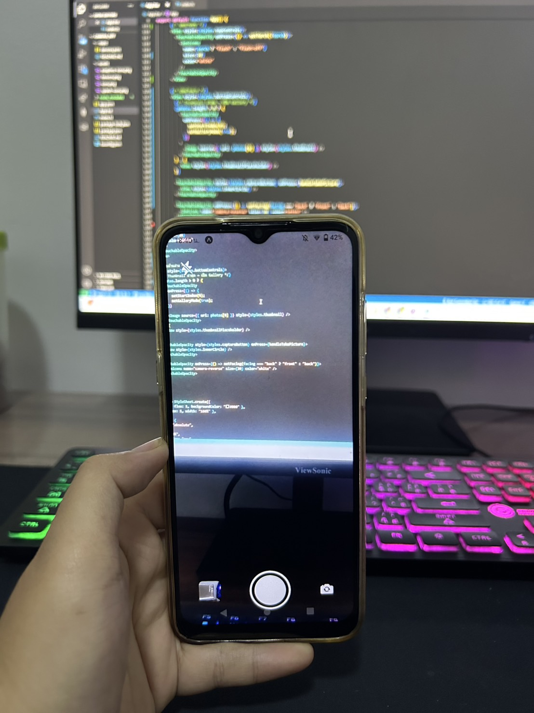
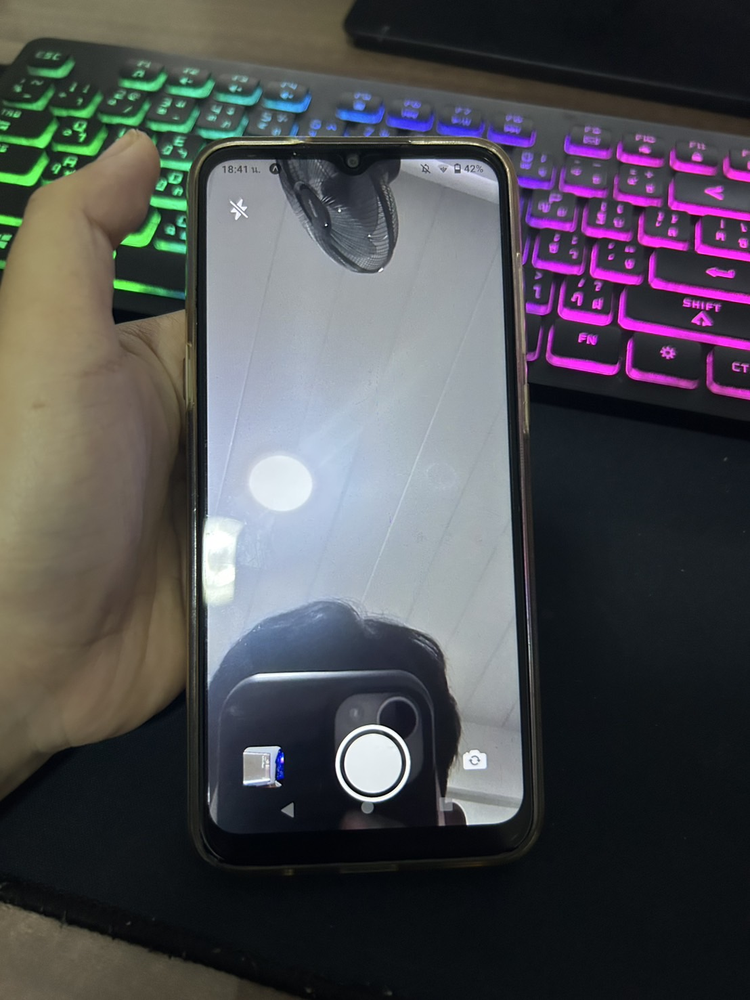
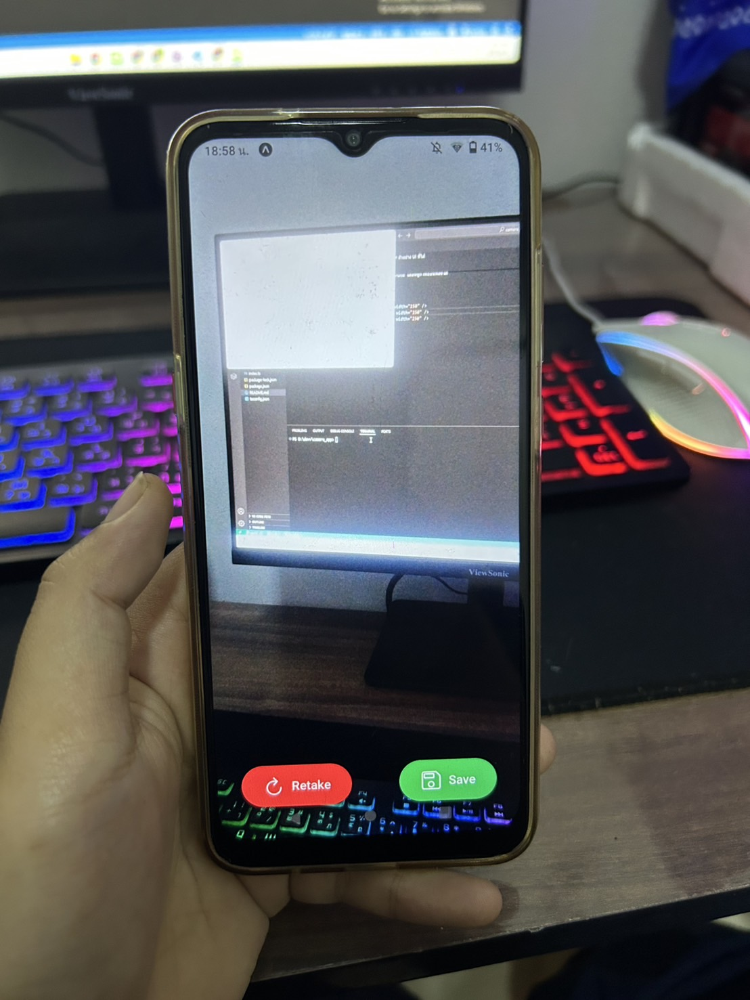
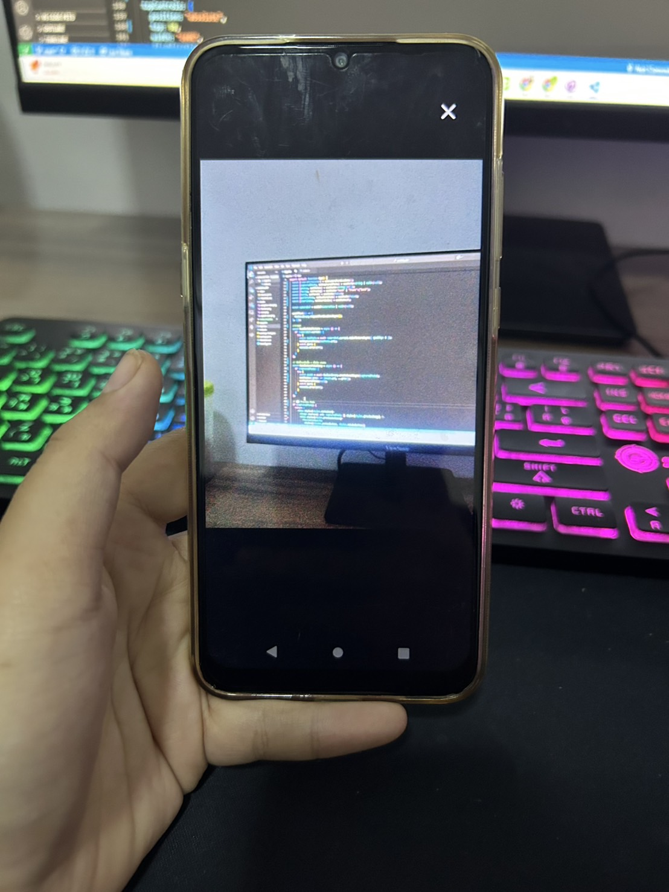

# React Native Camera App (Expo)

แอปถ่ายภาพด้วย **React Native + Expo Camera**  
สามารถถ่ายรูป, เปิดแฟลช, สลับกล้องหน้า-หลัง, บันทึกลงแกลเลอรี และดูภาพย้อนหลังได้

## ฟีเจอร์

- ถ่ายรูปด้วยกล้องหน้าและกล้องหลัง  
- เปิด-ปิด Flash/Torch ได้  
- แสดง Preview หลังถ่ายภาพ → เลือกบันทึกหรือถ่ายใหม่  
- บันทึกลง **Gallery** (Media Library)  
- มี **Gallery Mode** สำหรับเลื่อนดูภาพย้อนหลัง  
- แสดง Thumbnail ล่าสุดบนหน้ากล้อง  

## รันและติดดั้ง

## ติดตั้ง dependencies
 npm install

 ## รันบน Expo Go
 npx expo start

 ## สแกน QR Code บนมือถือ แอพพลิเคชั่น Expo Go

 ## การใช้งาน
  -กดปุ่มวงกลมตรงกลาง → ถ่ายรูป
  -เมื่อถ่ายเสร็จ → เลือก Save เพื่อบันทึก หรือ Retake เพื่อถ่ายใหม่
  -กดที่ Thumbnail มุมซ้ายล่าง → เข้าสู่ Gallery Mode เลื่อนดูภาพย้อนหลังได้
  -กดปุ่ม Flash icon → เปิด/ปิดไฟฉาย
  -กดปุ่ม Camera reverse → สลับกล้องหน้า/หลัง

  ## ตัวอย่าง UI ที่ได้
🔹 Camera Mode

🔹 Preview Mode

🔹 Gallery Mode
