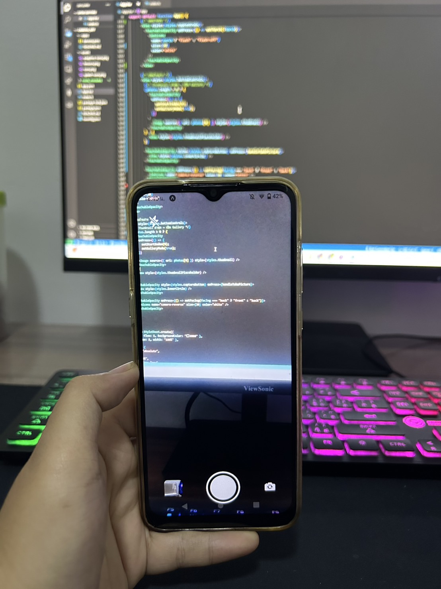
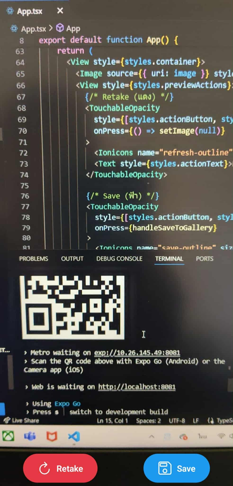

# React Native Camera & Media Library App

สำหรับ **ถ่ายรูปด้วยกล้อง** และ **บันทึกรูปลง Media Library** บน React Native (Expo) รองรับการสลับกล้องหน้า-หลัง และแฟลช

## Features

- ปุ่มถ่ายรูป แสดงภาพของกล้องปัจจุบัน
- ปุ่มถ่ายรูปใหม่ เมื่อได้ภาพที่ถ่ายให้แสดงรูปที่ถ่าย
- ปุ่มบันทึก เมื่อกดแล้วให้บันทึกรูปลงอัลบั้มในเครื่อง
- ปุ่มสลับกล้อง ให้กดแล้วทำการเปลี่ยนกล้องหน้าเป็นกล้องหลัง สลับกัน
- ปุ่มเปิดไฟแฟลช กดเพื่อเปิดไฟหลังกล้องถ่ายรูป

---

## ตัวอย่าง UI ที่ได้

  
  

---

## วิธีสร้างโปรเจกต์

npx create-expo-app@latest camera-app --template blank-typescript

## ติดตั้งไลบรารี
- cd camera-app
- npx expo install expo-camera expo-media-library

## เรียกใช้แอป
npx expo start

**จากนั้นสแกนโค้ด QR ด้วย Expo Go**

